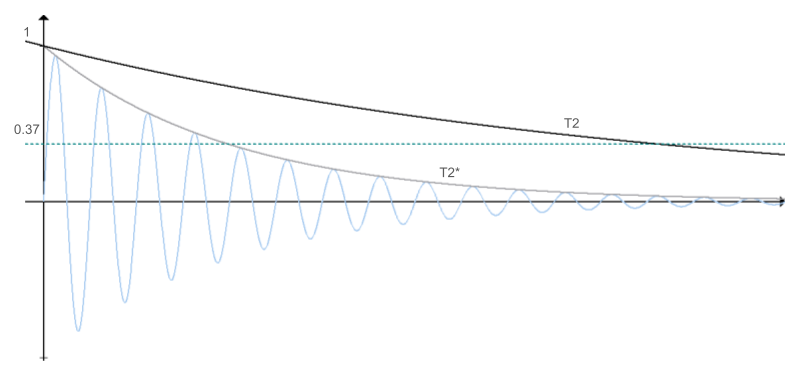
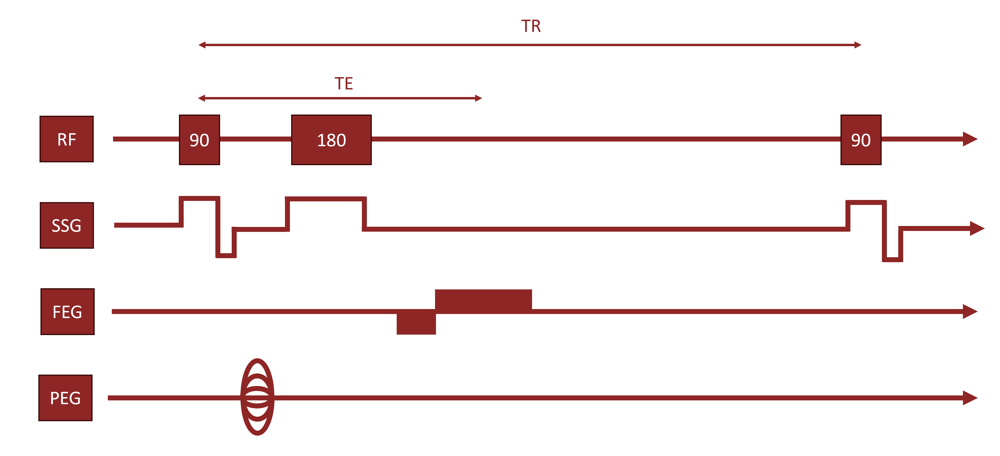
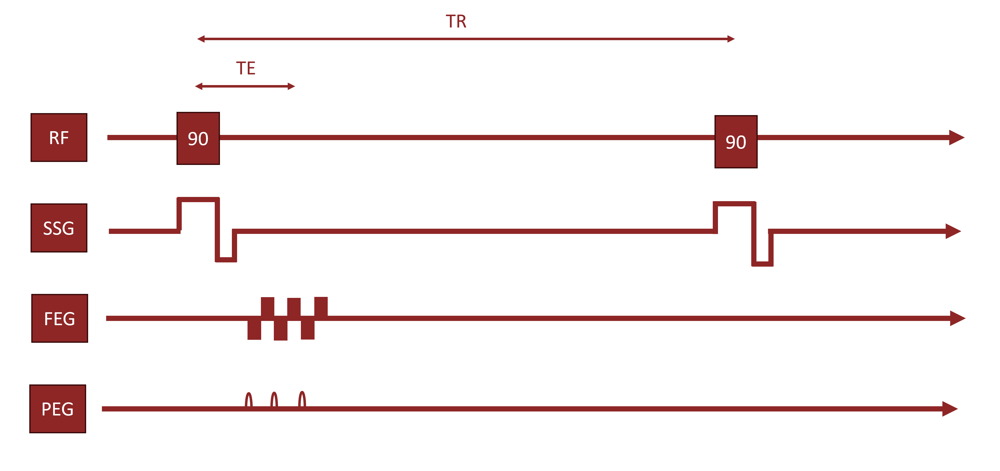
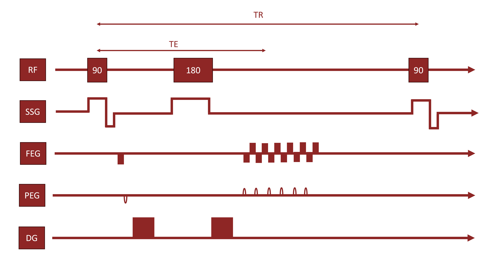

# Magnetic Resonance Imaging (MRI) Background

## Contents

- [Magnetic Resonance Imaging (MRI)](#magnetic-resonance-imaging-mri-background)
- [Functional Magnetic Resonance Imaging (fMRI)](#functional-magnetic-resonance-imaging-fmri)
- [Diffusion Tensor Imaging (DTI)](#diffusion-tensor-imaging-dti)
- [References](#references)

Magnetic Resonance Imaging (MRI) is the basis for both fMRI and DTI. Different tissues produce different signals under the electromagnetic conditions of an MRI scanner, and these signals can be reconstructed into an image. Different MRI *sequences* (used for fMRI, DTI, etc.) combine the same handful of core components in different ways.

## Main Magnetic Field & Larmor Frequency

- MRI starts by applying a main magnetic field, **B₀**, along the body (z-axis).
- This aligns atomic magnetic moments into a **net magnetization vector** pointing along B₀.
- Atoms precess around this field at a set frequency — the **Larmor frequency**:

$$
f_0 = \gamma B_0
$$

- $\gamma$ is the gyromagnetic ratio, specific to the atom (for hydrogen, $\gamma = 42.58~\text{MHz/T}$).
- The Larmor frequency depends on the magnetic field and atom type — **not** on tissue type.

## RF Pulses & Resonance

- At this point, there's no measurable signal — no **transverse magnetization** (magnetization perpendicular to B₀) exists yet.
- A **radiofrequency (RF) pulse** at the Larmor frequency induces resonance, tipping atoms so they gain a transverse component.
- RF pulses are named by their **flip angle** (how far they tip the net magnetization vector), which depends on pulse duration.
  - A **90° pulse** produces maximum transverse magnetization.
  - Other flip angles are often used to save scan time (Bernstein et al., 2004).

## Relaxation: T1, T2, and T2*

After an RF pulse, two independent relaxation processes occur:

### T1 Relaxation — recovery of longitudinal magnetization
- Governed by **spin-lattice interactions** (atom ↔ surrounding tissue).
- Highly tissue-dependent.
- **T1** = time for 63% of longitudinal magnetization to recover after a 90° pulse.
- Can't be measured directly (only transverse magnetization is measurable) — instead, a second 90° pulse is applied after a **repetition time (TR)**, and the contrast this reveals reflects T1 recovery.

### T2 Relaxation — loss of transverse magnetization
- Governed by **spin-spin interactions** (atoms interacting with each other) — atoms fall out of phase.
- Also tissue-dependent, independent of T1.
- Two variants:
  - **T2\*** — decay time including *both* spin-spin interactions and magnetic field heterogeneity (local field distortions from the scanner, tissue, or nearby atoms). Decays quickly — usually unwanted.
  - **T2** — decay from spin-spin interactions alone, with field heterogeneity effects removed.

*Comparison of T2 and T2\* decay, showing the faster decline of T2\* due to magnetic field heterogeneity. Adapted from Denck (2022).*

- T2\* effects are corrected with a **180° pulse**, which reverses spin positions so faster- and slower-decaying atoms realign.
- Atoms come back into phase at the **time to echo (TE)** — the point at which the signal is actually measured, canceling out field-heterogeneity effects.

### TR, TE, and Image Weighting
| Setting | Effect |
|---|---|
| Short TR & TE | Contrast dominated by T1 → **T1-weighted image** |
| Long TR & TE | Contrast dominated by T2 → **T2-weighted image** |

## Spatial Encoding

A raw RF signal only reflects the *net* magnetization vector — all spatial information is lost. **Spatial encoding** recovers it using three gradients, one per axis:

| Axis | Gradient | Abbreviation |
|---|---|---|
| z | Slice Selection Gradient | SSG |
| x | Frequency Encoding Gradient | FEG |
| y | Phase Encoding Gradient | PEG |

*RF pulses, SSG, FEG, and PEG timing for the spin echo sequence used in anatomical MRI (for fMRI/DTI coregistration). Adapted from Nel (2023).*

- **SSG (z-axis):** Creates a magnetic field gradient along z, so only one slice has a Larmor frequency matching the RF pulse — that's the only slice that resonates and produces a signal. This is how a specific slice is selected.
- **FEG (x-axis):** Applied around TE, varies signal frequency along x. A Fourier transform separates the signal by column within the slice.
- **PEG (y-axis):** Applied between the 90° and 180° pulses. Phase differences can only be compared across repeated acquisitions, so PEG strength is varied across repeated TR cycles.

## k-Space & Resolution

- FEG and PEG measurements combine into **k-space**; a 2D Fourier transform decodes this into a signal value per voxel.
- Spatial resolution by axis:
  - **z-axis:** number of slices
  - **x-axis:** number of measurements taken at TE
  - **y-axis:** number of phase-encoding steps

Different MRI sequences adjust these same building blocks (TR, TE, gradients) to extract different kinds of information — including the functional and structural information used in fMRI and DTI.

[↑ Back to top](#contents)

---

# Functional Magnetic Resonance Imaging (fMRI)

The spin echo sequence above encodes no temporal information and needs multiple RF pulses to gather spatial data. fMRI modifies the acquisition sequence to gain temporal resolution, taking advantage of a convenient physiological fact: blood oxygenation tracks neural activity.

## The Core Assumption: Oxygen ↔ Activity

- Neurons (like all cells) need oxygen, delivered by red blood cells.
- Oxygen delivery to a brain region isn't constant — it fluctuates with cognitive/behavioral activity, shifting the ratio of **oxygenated** to **deoxygenated** blood.
- **Core fMRI assumption:** a change in oxygen delivery to a region indicates a change in activity there.
  - Well-supported by metabolic biology (Davis et al., 1998; Thompson, 2018) and by correlation with other activity measures (Ugurbil et al., 2003; Kim et al., 2004).
  - fMRI does **not** measure neural activity directly — it measures a metabolic *consequence* of activity.
- When a neuron is more active, nearby vessels dilate and deliver oxygenated blood in excess of immediate need — so the oxygenated:deoxygenated ratio rises both upstream and downstream of the active neuron. This is why the signal stays meaningful even at spatial resolutions coarser than individual neurons.

## Why Blood Oxygenation Affects the MRI Signal

- Red blood cells carry oxygen via **hemoglobin**, which binds oxygen through an iron atom.
- Oxygenated hemoglobin is **less paramagnetic** than deoxygenated hemoglobin.
- More deoxygenated blood → greater local magnetic field disruption.

This connects directly back to T2*: local field distortions from deoxygenated blood show up in the **T2\* decay curve** (see [T2 vs. T2\* figure](#relaxation-t1-t2-and-t2) above). More activity → less deoxygenated blood → less distortion → measurable contrast in T2\* decay.

## The Echo Planar Sequence

- fMRI is built to measure *during* T2\* decay and **skips the 180° re-phasing pulse** used in spin echo.
- Trade-off: **higher temporal resolution**, at the cost of **spatial resolution** (x/y spatial encoding is shortened).
- This modified sequence is called the **echo planar sequence**.

*RF pulses, SSG, FEG, and PEG timing for the echo planar sequence used in fMRI. Adapted from Nel (2023).*

- Temporal resolution gains are usually worth the spatial trade-off, especially when fMRI data can be co-registered with a higher-resolution anatomical scan (from the spin echo sequence).

## Task vs. Resting-State fMRI

- fMRI data is *functional* — tied to activity, not just structure.
- **Task-based fMRI:** participant performs a task; active regions light up in the data.
- **Resting-state fMRI** *(used in this project)*: participant does no task during scanning.
  - Treated as a measure of spontaneous brain activity and connectivity absent targeted behavior (Gonzalez-Castillo et al., 2021).
  - Widely used to study functional brain networks (Eguíluz et al., 2005; Bassett & Bullmore, 2006).

## Temporal Resolution Caveat

- fMRI temporal resolution is on the order of **a few seconds** — not instantaneous.
- Limited by two things:
  1. It measures a *metabolic consequence* of activity, not activity itself.
  2. Spatial encoding still takes time, even in the shortened echo planar form.

[↑ Back to top](#contents)

---

# Diffusion Tensor Imaging (DTI)

DTI provides **structural** information about the brain, built from the physical relationship between axons and water molecules.

## Why Axons Matter

- Axons — the elongated part of a neuron that carries signals between locations — make up a large share of a neuron's size and volume (Muzio et al., 2025).
- Viewing the pathways axons form (especially in axon-dense **white matter**) reveals connectivity between brain regions.

## Water Diffusion & Axon Structure

- The brain contains a lot of water, which (among other roles) acts as a solvent for the ions responsible for the brain's electrical activity (Kimelberg, 2004).
- Water molecules constantly move via **Brownian motion** — normally random/unimpeded.
- Non-permeable membranes restrict that randomness, biasing net movement in a particular direction.
- Axons, coated in fatty **myelin sheaths**, restrict water movement *across* the axon — so water moves preferentially *along* the axon (Aung et al., 2013).
- This directionally-restricted movement is called **anisotropic diffusion**.

## Detecting Diffusion: The DTI Sequence

DTI uses a modified echo planar sequence that reintroduces the **180° pulse** and adds strong **diffusion gradients (DG)** — six directions are needed for full tensor analysis.

- A diffusion gradient is applied **before** the 180° pulse, and an equal-and-opposite gradient **after** it (equal and opposite because the 180° pulse reverses the precession direction).
- **If a molecule doesn't move:** it experiences equal and opposite gradients before/after the pulse → follows the normal T2 decay curve.
- **If a molecule is free to move:** it may shift into a different part of the gradient field between the two exposures → doesn't fully cancel out → loses transverse magnetization faster → **lower signal**.
- Net effect: **less restricted movement along an axis → lower signal along that axis.** This is what lets DTI infer axon orientation from signal loss patterns.

*RF pulses, SSG, FEG, PEG, and the diffusion gradient (DG) timing for the DTI echo planar sequence. Adapted from Nel (2023).*

## What DTI Actually Measures

- DTI does **not** resolve individual axons.
- It represents general **tracts** — directions along which water motion is measurably more restricted, aggregated over a voxel.
- DTI-derived tract structure is well-established and corroborated by other anatomical methods (Conturo et al., 1999; Wakana et al., 2004).
- How structural connectivity (DTI) relates to functional connectivity (fMRI), and how that relationship changes over the lifespan, remains an open research question — which is part of why combined fMRI + DTI datasets are valuable.

[↑ Back to top](#contents)

---

## References

Aung, W. Y., Mar, S., & Benzinger, T. L. (2013). Diffusion tensor MRI as a biomarker in axonal and myelin damage. *Imaging in Medicine*, 5(5), 427–440. https://doi.org/10.2217/iim.13.49

Bassett, D. S., & Bullmore, E. (2006). Small-world brain networks. *The Neuroscientist*, 12(6), 512–523. https://doi.org/10.1177/1073858406293182

Bernstein, M. A., King, K. F., & Zhou, X. J. (2004). Introduction to radiofrequency pulses. In M. A. Bernstein, K. F. King, & X. J. Zhou (Eds.), *Handbook of MRI pulse sequences* (pp. 29–34). Academic Press. https://doi.org/10.1016/B978-012092861-3/50005-4

Conturo, T. E., Lori, N. F., Cull, T. S., Akbudak, E., Snyder, A. Z., Shimony, J. S., McKinstry, R. C., Burton, H., & Raichle, M. E. (1999). Tracking neuronal fiber pathways in the living human brain. *Proceedings of the National Academy of Sciences*, 96(18), 10422–10427. https://doi.org/10.1073/pnas.96.18.10422

Davis, T. L., Kwong, K. K., Weisskoff, R. M., & Rosen, B. R. (1998). Calibrated functional MRI: Mapping the dynamics of oxidative metabolism. *Proceedings of the National Academy of Sciences*, 95(4), 1834–1839. https://doi.org/10.1073/pnas.95.4.1834

Denck, J. (2022). *Machine learning-based workflow enhancements in magnetic resonance imaging* [Doctoral dissertation, Friedrich-Alexander-Universität Erlangen-Nürnberg].

Eguíluz, V. M., Chialvo, D. R., Cecchi, G. A., Baliki, M., & Apkarian, A. V. (2005). Scale-free brain functional networks. *Physical Review Letters*, 94(1), 018102. https://doi.org/10.1103/PhysRevLett.94.018102

Gonzalez-Castillo, J., Kam, J. W. Y., Hoy, C. W., & Bandettini, P. A. (2021). How to interpret resting-state fMRI: Ask your participants. *Journal of Neuroscience*, 41(6), 1130–1141. https://doi.org/10.1523/JNEUROSCI.1786-20.2020

Kim, D.-S., Ronen, I., Olman, C., Kim, S.-G., Ugurbil, K., & Toth, L. J. (2004). Spatial relationship between neuronal activity and BOLD functional MRI. *NeuroImage*, 21(3), 876–885. https://doi.org/10.1016/j.neuroimage.2003.10.018

Kimelberg, H. K. (2004). Water homeostasis in the brain: Basic concepts. *Neuroscience*, 129(4), 851–860. https://doi.org/10.1016/j.neuroscience.2004.07.033

Muzio, M. R., Fakoya, A. O., & Cascella, M. (2025). Histology, axon. In *StatPearls*. StatPearls Publishing.

Nel, M. (2023). *MRI physics* [Video playlist]. YouTube. https://www.youtube.com/playlist?list=PLWfaNqiSdtzVp5u79H_sFE4IPcjgwhKdQ

Thompson, G. J. (2018). Neural and metabolic basis of dynamic resting state fMRI. *NeuroImage*, 180, 448–462. https://doi.org/10.1016/j.neuroimage.2017.09.010

Uğurbil, K., Toth, L., & Kim, D.-S. (2003). How accurate is magnetic resonance imaging of brain function? *Trends in Neurosciences*, 26(2), 108–114. https://doi.org/10.1016/S0166-2236(02)00039-5

Wakana, S., Jiang, H., Nagae-Poetscher, L. M., van Zijl, P. C. M., & Mori, S. (2004). Fiber tract-based atlas of human white matter anatomy. *Radiology*, 230(1), 77–87. https://doi.org/10.1148/radiol.2301021640
